# 파트너 아키텍처 흐름도 — 외부 참조 샘플

> **분류**: 참조 자료 (영감 소스). **렌더러 컨트랙트 아님.**
> **아카이브 일자**: 2026-05-19
> **출처**: 사용자 실무 프로젝트의 수동 큐레이션 산출물 (Spring Boot + React, 약 28 화면, 4 도메인)
> **연관 메모리**: `reference_partner_architecture_sample.md`, `project_v13x_be_phase2_candidates.md`
>
> ---
>
> ## 보관 목적 및 적용 제약 (advisor 검증, 2026-05-19)
>
> 이 자료는 **사람이 큐레이션한 문서 아티팩트**다. codebase-viz는 **AST 결정론적 자동 생성 컨트랙트**이므로 자료의 모든 측면을 1:1 모사할 수 없다.
>
> **자동화 가능 (영감 추출 대상 = v1.3.x BE Adapter Phase 2 후보)**:
> - MyBatis XML statement-level 노드 + Repository.method ↔ statement 매핑 엣지 (현재 mybatis-parser는 TableNode만 emit)
> - API Endpoint와 Controller method 사이 fan-in 엣지 (현재 두 노드는 있으나 엣지 미생성)
> - 외부 시스템 노드 (SAP RFC / RestTemplate / WebClient / FeignClient)
> - DB Table 다중 묶음 cluster 노드 (Tab1/2 leaf 옆 새 view — Tab3 수정 아님)
>
> **자동화 불가 (이 자료에만 유효)**:
> - 엔드포인트 수동 번호 매김 (①②③)
> - XML statement의 의미 그룹 라벨 (`[조회]`, `[저장]`, `[SP 호출]`) — LLM 영역
> - "⚠️ FE API Hook 미발견" 같은 수동 경고
> - 화면(Page) 단위 분리 다이어그램 (985 라우트 프로젝트에서 비현실적)
> - 5층 통합 한 다이어그램 (v1.1.53 trilemma 재현 위험)
>
> **표준과의 충돌 (BE-DIAGRAM-STANDARD.md v1.0, 변경 차단)**:
> - R-T2.2 3-layer DI ↔ 자료 4-layer (XML statement 추가)
> - R-T1.6 endpoint=Controller leaf 내부 subgraph ↔ 자료 분리 fan-in (시각 모델 상호 배타)
> - 색 충돌: 표준 `ssr`(녹색, FE SSR) ↔ 자료 `ctrl`(녹색, BE Controller) — Fullstack pair-analysis silent corruption
> - Tab3 "변경 없음" 박제 ↔ 자료의 cluster table 노드 (Tab1/2 leaf 옆 새 view)
> - IR 확장 필수 (statement-level NodeKind 신규)
>
> → **표준 v1.1 발행 + IR 확장 + 별도 minor bump(v1.3.x BE Adapter Phase 2) 필요**. 현 v1.2.41+ 궤도(T1·T2·T3 UX 폴리시)와 분리.
>
> ---
>
> 이하 원본 자료 (사용자 제공, 2026-05-19):

---

# 파트너 전체 아키텍처 흐름도 — 가시화 (Flowchart)

> Mermaid 렌더링 지원 뷰어(VS Code / GitHub / Confluence) 에서 열어야 차트가 표시됩니다.

---

## 진행 현황

| 도메인 | 상태 | 완료일 |
|---|---|---|
| [가공협력사] 주문생산 계획관리 | ✅ 완료 | 2026-05-19 |
| [가공협력사] 자재관리 | ✅ 완료 | 2026-05-19 |
| [가공협력사] 실적관리 | ✅ 완료 | 2026-05-19 |
| [본사] 협력사관리 | ✅ 완료 | 2026-05-19 |

---

## 범례

```mermaid
flowchart LR
    classDef fe    fill:#1a5276,color:#fff,stroke:#0d2b4e
    classDef api   fill:#1a6fa8,color:#fff,stroke:#124f7a
    classDef ctrl  fill:#1e6b37,color:#fff,stroke:#144d27
    classDef svc   fill:#6c3483,color:#fff,stroke:#4a235a
    classDef map   fill:#ba4a00,color:#fff,stroke:#7d3200
    classDef xml   fill:#922b21,color:#fff,stroke:#641d17
    classDef db    fill:#2c3e50,color:#fff,stroke:#1a252f

    A["🖥️ FE 화면"]:::fe
    B["📡 API Endpoint"]:::api
    C["⚙️ Controller"]:::ctrl
    D["🔧 ServiceImpl"]:::svc
    E["🗂️ Repository"]:::map
    F["📄 XML Query"]:::xml
    G[("🗄️ DB Table")]:::db

    A --> B --> C --> D --> E --> F --> G
```

---

## 1. 주문생산 계획관리 (ordProdPlanMgmt)

### 1-0. 전체 구조 개요

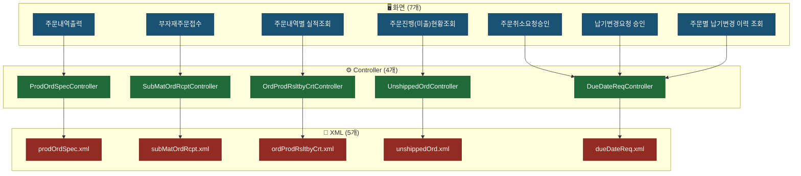

---

### 1-1. 주문내역출력

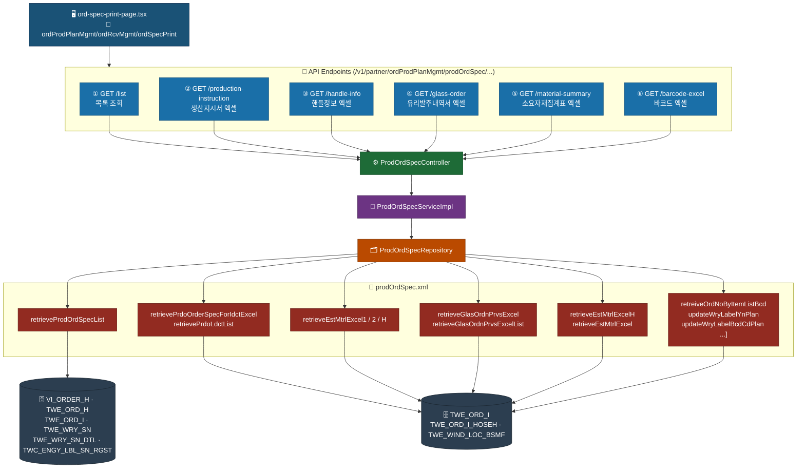

---

### 1-2. 부자재주문접수

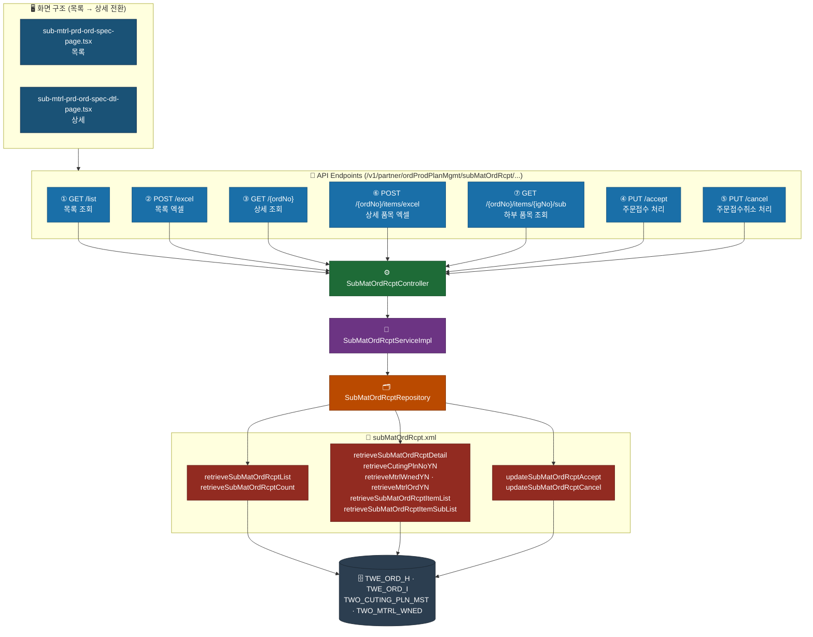

---

### 1-3. 주문내역별 실적조회

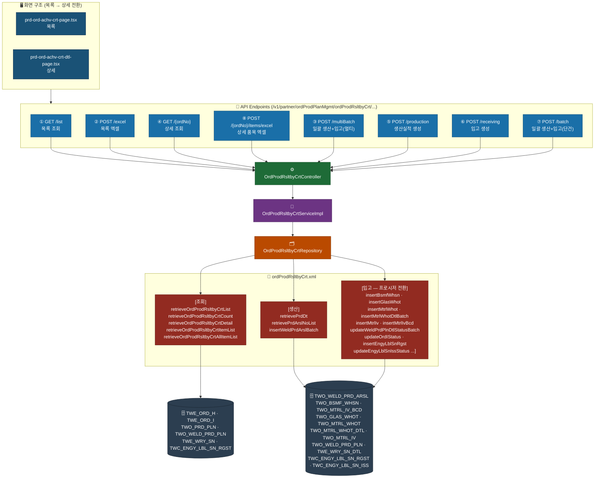

---

### 1-4. 주문진행(미출)현황조회

> ⚠️ FE API Hook 미발견 — BE URL은 `/v1/partner/ordProdPlanMgmt/unshippedOrd/` 확인됨. FE 연결 재확인 필요.

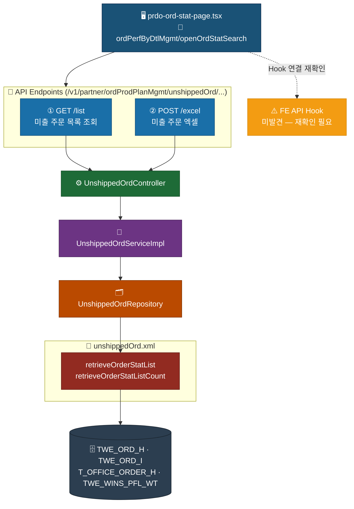

---

### 1-5. 주문취소요청승인

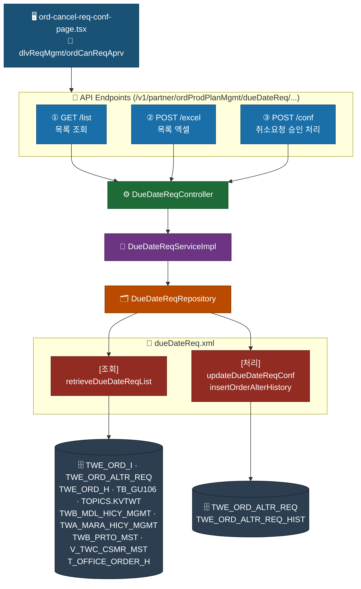

---

### 1-6. 납기변경요청 승인

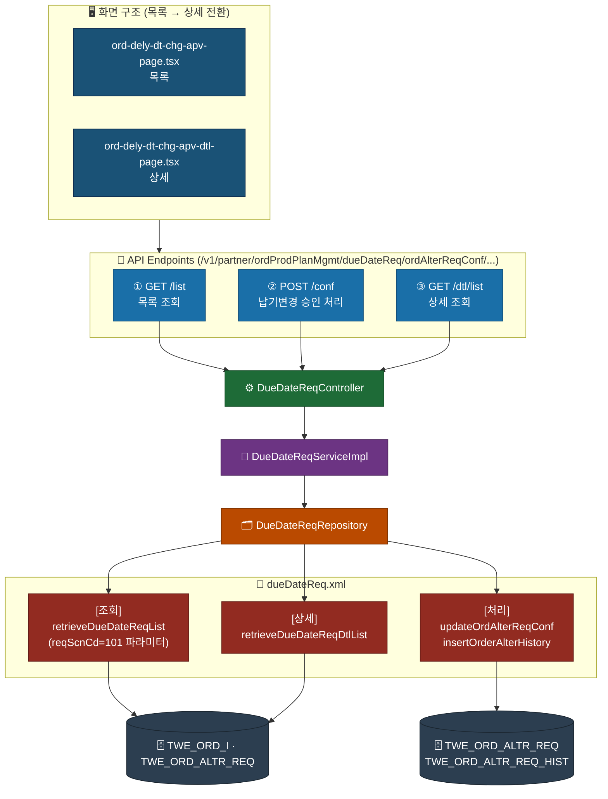

---

### 1-7. 주문별 납기변경 이력 조회

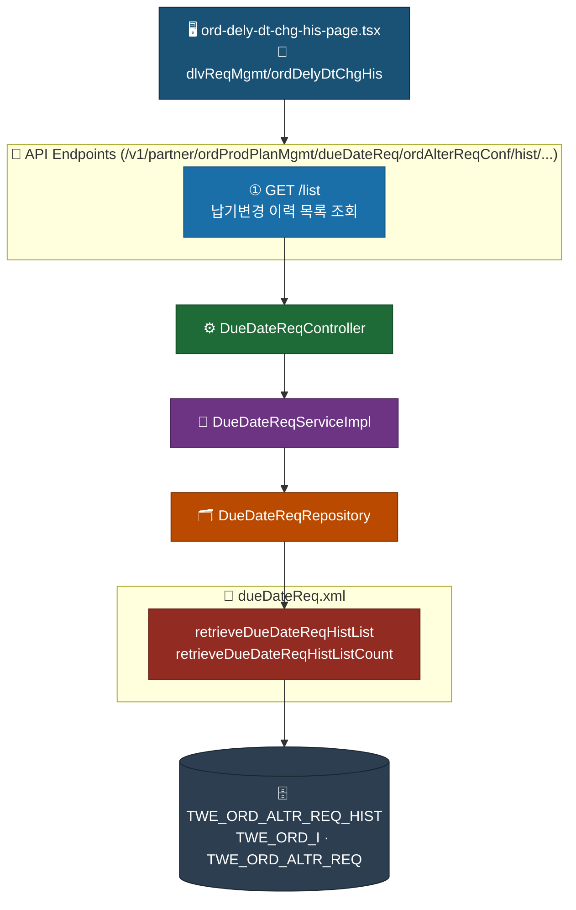

---

## 2. 자재관리 (matMgmt)

### 2-0. 전체 구조 개요

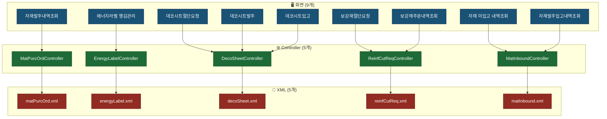

---

### 2-1. 자재발주내역조회

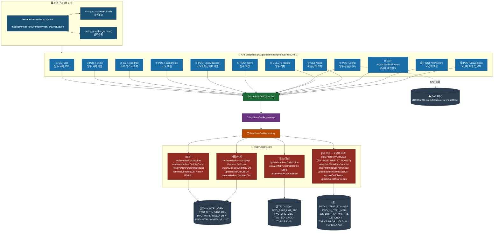

---

### 2-2 ~ 2-9, 3-1 ~ 3-8, 4-1 ~ 4-4 (총 19개 다이어그램)

원본은 2026-05-19 codebase-viz 세션 사용자 메시지에 보존. 패턴이 위 1-1 ~ 2-1과 동일하게 반복(`FE Page → API Endpoints subgraph → Controller → ServiceImpl → Repository → XML statement group → DB Table cluster`)되므로 영감 추출에는 위 샘플로 충분.

추가 패턴 변형 케이스만 발췌:
- **viewMode 컨테이너** (2-3, 2-4, 2-9): 한 페이지 컴포넌트가 viewMode prop으로 목록↔등록↔상세 분기. FE 라우트는 1개지만 논리 화면 다수
- **외부 시스템 노드 (SAP RFC)** (3-2, 3-4, 3-5, 3-6, 3-7): `☁️ SAP RFC\nZ_RFC_EPS30` 같은 별도 분류 노드, dashed edge로 호출 관계 표시
- **DB만 vs DB+SAP 혼합** (3-5 미출현황조회): SAP backOrderList → DB perfStatusDetail join 흐름
- **Master/Detail 그리드** (3-1 거래명세표): 한 페이지에 두 그리드 동시 표시, API endpoint도 master·detail 분리

> 위 4종 패턴은 v1.3.x BE Adapter Phase 2 설계 시 별도 처리 케이스로 검토할 가치 있음.

