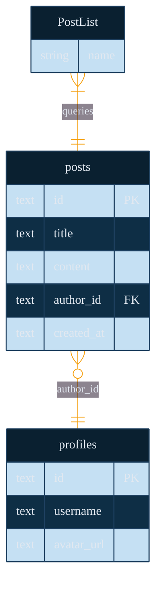

# DB–Screen Mapping

```mermaid
%%{init:{'theme':'base','themeVariables':{'background':'#060810','primaryColor':'#0a2030','primaryTextColor':'#e2e8f0','primaryBorderColor':'#1e4060','lineColor':'#f59e0b','secondaryColor':'#0f172a','tertiaryColor':'#1a0a20','attributeBackgroundColorEven':'#0f1e30','attributeBackgroundColorOdd':'#091624','nodeBorder':'#1e4060','clusterBkg':'#0a0e1a','fontFamily':'JetBrains Mono'}}}%%
erDiagram
  posts {
    text id PK
    text title
    text content
    text author_id FK
    text created_at
  }
  profiles {
    text id PK
    text username
    text avatar_url
  }
  PostList {
    string name
  }
  posts }o--|| profiles : "author_id"
  PostList }|--|| posts : "queries"
```
