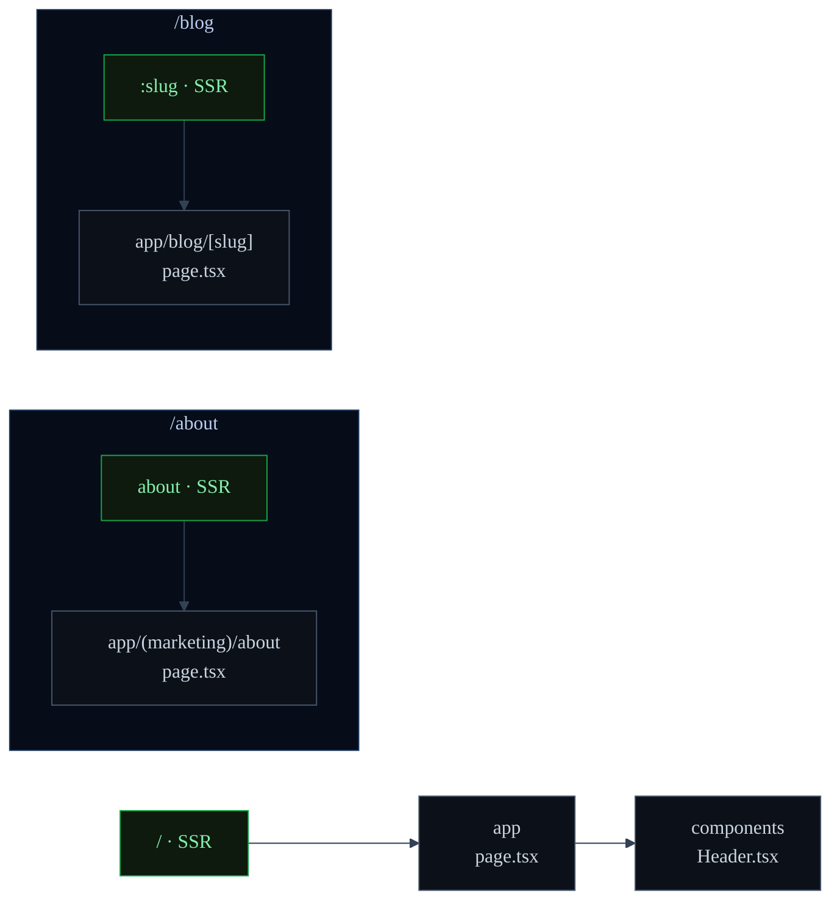

# Screen–Component Mapping

```mermaid
%%{init:{'theme':'base','themeVariables':{'background':'#060810','primaryColor':'#0c1a30','primaryTextColor':'#7dd3fc','primaryBorderColor':'#0e3a6e','edgeLabelBackground':'#0c1a30','lineColor':'#334155','secondaryColor':'#0f172a','clusterBkg':'#060c18','clusterBorder':'#1e3a5f','fontFamily':'JetBrains Mono','fontSize':'14'}}}%%
graph LR
  classDef ssr fill:#0d1a0d,stroke:#16a34a,color:#86efac
  classDef csr fill:#2d1200,stroke:#c2410c,color:#fb923c
  classDef ssg fill:#1a0d1a,stroke:#7c3aed,color:#c4b5fd
  classDef isr fill:#1a1a0d,stroke:#ca8a04,color:#fde047
  classDef ppr fill:#0d1a2d,stroke:#2563eb,color:#93c5fd
  classDef unk fill:#1a1a1a,stroke:#6b7280,color:#9ca3af
  classDef pkg fill:#0c1018,stroke:#475569,color:#cbd5e1
  classDef muted fill:#0a0d14,stroke:#374151,color:#64748b,stroke-dasharray: 3 3
  classDef hdr fill:#06080f,stroke:#1e3a5f,color:#7dd3fc
  subgraph ABOUT_T["👤 /about"]
    route_app__marketing__about_page["about · SSR"]:::ssr
    file_component_app__marketing__about_page_tsx_page["📂 app/(marketing)/about<br/>📄 page.tsx"]:::pkg
    route_app__marketing__about_page --> file_component_app__marketing__about_page_tsx_page
  end
  subgraph BLOG_T["📝 /blog"]
    route_app_blog__slug__page[":slug · SSR"]:::ssr
    file_component_app_blog__slug__page_tsx_page["📂 app/blog/[slug]<br/>📄 page.tsx"]:::pkg
    route_app_blog__slug__page --> file_component_app_blog__slug__page_tsx_page
  end
  route_app_page["/ · SSR"]:::ssr
  file_component_app_page_tsx_page["📂 app<br/>📄 page.tsx"]:::pkg
  route_app_page --> file_component_app_page_tsx_page
  file_component_components_Header_tsx_Header["📂 components<br/>📄 Header.tsx"]:::pkg
  file_component_app_page_tsx_page --> file_component_components_Header_tsx_Header
```
