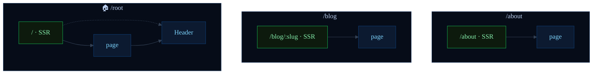

# Screen–Component Mapping

```mermaid
%%{init:{'theme':'base','themeVariables':{'background':'#060810','primaryColor':'#0c1a30','primaryTextColor':'#7dd3fc','primaryBorderColor':'#0e3a6e','edgeLabelBackground':'#0c1a30','lineColor':'#334155','secondaryColor':'#0f172a','clusterBkg':'#060c18','clusterBorder':'#1e3a5f','fontFamily':'JetBrains Mono'}}}%%
graph TB
  classDef ssr fill:#0d1a0d,stroke:#16a34a,color:#86efac
  classDef csr fill:#2d1200,stroke:#c2410c,color:#fb923c
  classDef ssg fill:#1a0d1a,stroke:#7c3aed,color:#c4b5fd
  classDef isr fill:#1a1a0d,stroke:#ca8a04,color:#fde047
  classDef ppr fill:#0d1a2d,stroke:#2563eb,color:#93c5fd
  classDef unk fill:#1a1a1a,stroke:#6b7280,color:#9ca3af
  subgraph ABOUT_S["👤 /about"]
    direction LR
    route_app__marketing__about_page["/about · SSR"]:::ssr
    component_app__marketing__about_page_tsx_page["page"]
  end
  subgraph BLOG_S["📝 /blog"]
    direction LR
    route_app_blog__slug__page["/blog/:slug · SSR"]:::ssr
    component_app_blog__slug__page_tsx_page["page"]
  end
  subgraph ROOT_S["🏠 /root"]
    direction LR
    route_app_page["/ · SSR"]:::ssr
    component_app_page_tsx_page["page"]
    component_components_Header_tsx_Header["Header"]
  end
  route_app__marketing__about_page --> component_app__marketing__about_page_tsx_page
  route_app_blog__slug__page --> component_app_blog__slug__page_tsx_page
  route_app_page --> component_app_page_tsx_page
  route_app_page -.-> component_components_Header_tsx_Header
  component_app_page_tsx_page --> component_components_Header_tsx_Header
```
